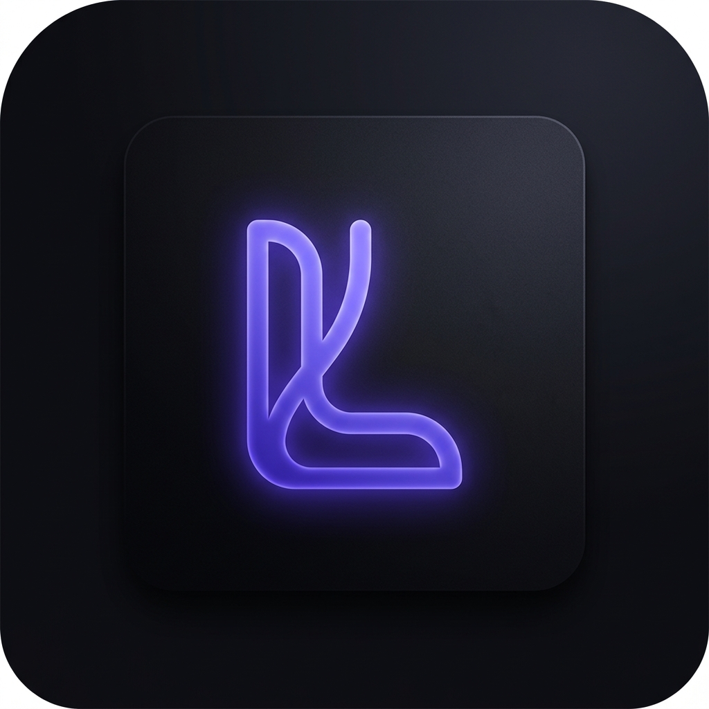

<div align="center">
  
  <h1>Lucid</h1>
  <p><strong>A lightning-fast AI Meeting Assistant designed for professionals, managers, and developers.</strong></p>
  <p>
    <a href="https://tauri.app/">
      
    </a>
    <a href="https://reactjs.org/">
      
    </a>
    <a href="https://www.rust-lang.org/">
      
    </a>
  </p>
</div>

<br />

Lucid is a professional desktop application that enhances meeting productivity by merging Large Language Models with deep OS-level window integrations. Built on the **Tauri v2 API** backend with a highly-optimized **React/Vite** frontend, it delivers instant summaries, real-time transcription, and robust knowledge management.

## ✨ Core Features

- 🧠 **Reliable Multi-Model Routing**
  - Natively supports Groq (Llama 3), Gemini 1.5 Pro, DeepSeek V3, OpenRouter, and local Ollama integrations.
  - Implements an "Intelligent Failover" system: if a provider is unavailable, Lucid automatically switches to the next available model to ensure uninterrupted meeting support.
- 🖼️ **Non-Intrusive Focus HUD**
  - **Overlay Mode:** Provides a clean, heads-up display for meeting notes that stays on top without obstructing your workflow.
  - **Privacy First:** Advanced `SetWindowDisplayAffinity` integration ensures that sensitive internal notes and private meeting data are excluded from screen recordings and screen shares (Zoom, Teams, etc.).
- 📸 **Smart Snipping Tool**
  - Instantly capture technical diagrams, whiteboard sketches, or presentation slides during meetings. 
  - Integrated Vision models (Gemini/OpenRouter) analyze captures to provide immediate technical context or action items.
- 🎨 **Executive Aesthetic**
  - Clean, professional UI with 5 curated themes: **Dark**, **Light**, **Slate**, **Nord**, and **Professional**.
  - Customizable transparency for a tailored workspace experience.
- 🗄️ **The Knowledge Base**
  - A local, secure repository for your meeting archives and technical documentation. 
  - Store complex requirements, project resumes, or meeting prompts securely for instant access during call-to-actions.

## 🚀 Getting Started

### Prerequisites
- [Node.js](https://nodejs.org/en/)
- [Rust Toolchain](https://rustup.rs/) (cargo, rustc)
- Windows 10/11 (Advanced window features require native Windows APIs)

### Installation

1. **Clone the repository**
   ```bash
   git clone https://github.com/HarshalPatel1972/lucid.git
   cd lucid
   ```
2. **Install dependencies**
   ```bash
   npm install
   ```
3. **Run the Development Server**
   ```bash
   npm run tauri dev
   ```

### Building for Production
To compile your standalone, production-ready application:
```bash
npm run tauri build
```
*(Your final execution binary will be generated under `src-tauri/target/release/Lucid.exe`)*

## ⚙️ App Architecture

1. **Rust Backend (`src-tauri/src/`)**: Leverages high-performance OS-level interactions. Uses `win32` APIs for native window layering, transparency, and background threaded API invocations.
2. **React Frontend (`src/`)**: Clean, reactive interface with unmounted view routing to preserve state across Chat, Knowledge Base, and Settings.

---
<div align="center">
  <p>Designed for professional workflows and peak organizational efficiency.</p>
</div>
